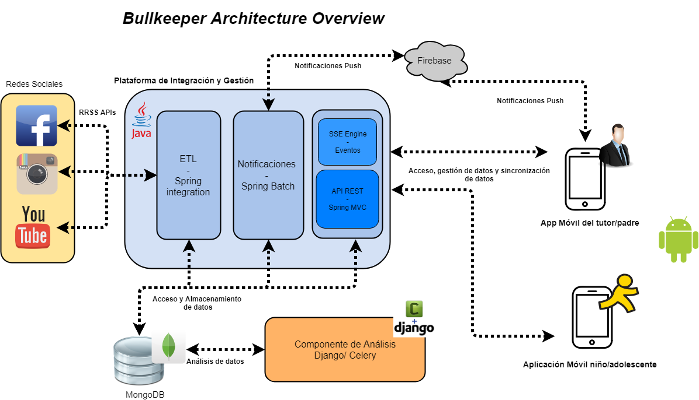

# 🚀 BullKeeper Integration Platform - Empowering Digital Safety and Control

The **BullKeeper Integration Platform** is a robust and versatile backend system designed to empower parents and guardians with the tools they need to ensure the digital safety and well-being of their children and adolescents. 📱👦👧

## 🌟 Platform Overview

Our platform acts as the digital guardian, supporting the functionality of various applications, including:

1. **[Bullkeeper (Android App - Parental control tool focused on the management of the digital lifestyle of children/adolescents)](https://github.com/sergio11/bullkeeper_app):** An Android App that serves as a dedicated parental control tool, focused on managing the digital lifestyles of children and adolescents.

2. **[BullKeeper Kids Android App - Tool aimed at children/adolescents to manage their fun time and ensure the rules of parental control set.](https://github.com/sergio11/bullkeeper_kids_app) :** A dynamic tool aimed at children and adolescents, allowing them to manage their leisure time while adhering to parental control rules.

## 📊 Data Interoperability

The BullKeeper Integration Platform excels at facilitating seamless interoperability with a range of systems and stakeholders, including parents, schools, and social media platforms. To safeguard data privacy and security, access to these services is carefully controlled. Parents and guardians must verify their identity and obtain an access token to access the API, which grants access only to information related to the children under their care.

## 🔑 Key Components

This powerful platform comprises four distinct and essential components:

### 1. ETL Process (Extract, Transform, Load)

- The ETL process is the engine behind the scenes. It extracts and consolidates comments and opinions posted by users (children/adolescents) across various social media platforms.
- Embracing well-established business integration patterns (EIP), with Spring Integration as its reference, it expertly manages data flow.
- This component integrates with diverse social media platforms, incrementally gathering resources from each environment.
- It homogenizes and structures the gathered data, making it ready for in-depth analysis.
- At regular intervals, it retrieves valid social media data assigned to each user under analysis.
- Error handling and alert generation are integral, ensuring a reliable and robust data collection process.

### 2. Hypermedia RESTful API

- Our Hypermedia RESTful API acts as the bridge connecting our platform to external systems and applications.
- It offers a user-friendly interface for accessing and manipulating system information, and robust security measures prevent unauthorized access to sensitive data.

### 3. SSE Event Engine (Server-Sent Events)

- The SSE Event Engine is the real-time heartbeat of our platform.
- It maintains open connections with mobile applications for short durations, ensuring the instantaneous exchange of updated information.
- Crucially, it keeps parental control rules and settings synchronized across devices, providing a cohesive and secure digital environment for children.

### 4. Multi-device Alert Notification System

- Our integrated Multi-device Alert Notification System integrates seamlessly with Firebase Cloud Messaging (FCM).
- This system ensures the swift and precise delivery of notifications for specific events and alerts related to supervised children and adolescents.

## 🏛️ Bullkeeper Architecture

[Insert a diagram or visual representation of the architecture here, if applicable]

The BullKeeper Integration Platform represents a holistic approach to digital safety and control, fostering responsible digital exploration for children and adolescents while providing peace of mind to parents and guardians.

## Visitors Count

## Please Share & Star the repository to keep me motivated.
  
  

